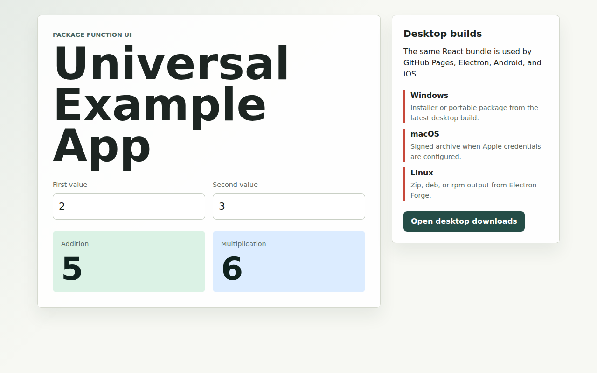
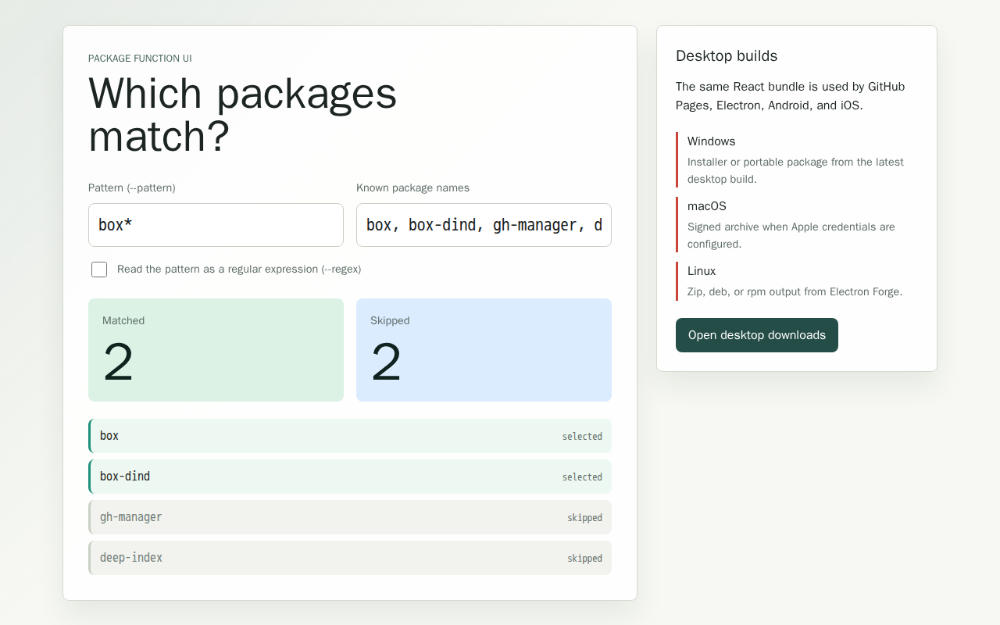

# Issue 12: completing the CI reliability fix

[Issue 12](https://github.com/link-foundation/gh-manager/issues/12) and [PR 14](https://github.com/link-foundation/gh-manager/pull/14) originally addressed a three-second shell-test budget and Bash expressions running under `sh`. PR 16 merged those fixes before PR 14 resumed. This branch merges current main, preserves the broader feature work, and retains a single Bash default plus environment-supplied drift. Warning tests use a ten-second budget, four-second workload and 30% warning threshold. Kill cases use five-second budgets and finite workers.

## Fresh CI evidence

The original [Checks and release run](https://github.com/link-foundation/gh-manager/actions/runs/37779097679) records the macOS failure at downloaded log lines 11216–11218: the warning test took 3217 ms and returned 124 instead of 0. The original [Example app run](https://github.com/link-foundation/gh-manager/actions/runs/37779097805) records `[[: not found` at line 1586.

The newer main runs were created at 2026-10-10 07:44:26 UTC for merge `ec9d02c`. All nine runtime/platform test jobs passed. The failures now have different causes:

- [Example app](https://github.com/link-foundation/gh-manager/actions/runs/38035458275), log lines 249–256: screenshot generation waits for `#calculator-title`, but the app renders `#matcher-title`.
- [Checks and release](https://github.com/link-foundation/gh-manager/actions/runs/38035458150), log lines 13441 and 13473–13483: first publication returns E404, but `0 packages are already published` incorrectly triggers conflict verification. Seven registry polls then hide the authentication error behind a generic verification failure.

Logs are preserved locally under ignored `ci-logs/` and `experiments/issue-12/*.log`.

The Docker Hub timeout messages in the original run came from the mock Docker CLI in passing retry/mirror tests (lines 11003–11013), rather than a failing Docker workflow step. The existing `setup-buildx-resilient` action already retries pulls with exponential backoff and a registry-mirror fallback; its tests still pass.

## Reproduction and fixes

Run `npm ci`, then `npm run example:web:preview-images`. Before the selector fix, Chromium reproduces the same ten-second `#calculator-title` timeout. After the fix, `PREVIEW_VERBOSE=1 npm run example:web:preview-images` generates all four locale/theme tiles and the fallback image at 1280×800. Playwright browser inspection also confirmed the matcher heading, zero calculator headings, and two selected/two skipped packages.

The new test in `tests/issue-12-reliability.test.js` compares the preview script's readiness selectors with the actual app heading. Two new `tests/publish-retry.test.js` cases reproduce the Changesets count misclassification and lost E404. All three tests failed before implementation. The classifier now ignores count-summary lines while preserving genuine version-conflict handling; the E404 is returned immediately and the existing browser-bootstrap guidance remains available.

The committed preview files now show the package matcher. These are generated artifacts; the app itself was not redesigned.

| Previously committed stale preview                               | Regenerated preview                                                       |
| ---------------------------------------------------------------- | ------------------------------------------------------------------------- |
|  |  |

## Sibling template scope

GitHub code search found the same warning test in `js-ai-driven-development-pipeline-template` and `disk-space-saviour`. Their current test files are identical. The patch preserved by PR 16 no longer applies after upstream test wrappers changed. [sibling-timing.patch](sibling-timing.patch) updates the current warning, kill, stubborn-command and fractional-poll cases, and bounds worker lifetimes. `git apply --check` succeeds against both downloaded current files. Apply it at the sibling repository root with `git apply /path/to/sibling-timing.patch`.

No sibling branch was pushed: this task authorizes pushes only to `issue-12-flaky-budget-and-preview-shell` in gh-manager.

## Validation

Node and Bun each passed 694 tests. Deno passed 631 tests with eight nested steps using CI's `--allow-read --allow-write --allow-env` permissions. `npm run check` passed lint, formatting and the duplication baseline. Script syntax checks and the 1500-line check passed. The full preview generation command completed successfully with verbose logging.

An initial concurrent Bun run encountered the existing bin-symlink test failure; its isolated run and the subsequent full run passed. Scratch copies of the sibling tests also entered Bun's recursive discovery during patch verification; retaining those downloaded sources with `.txt` extensions restored the intended 75-file suite. Neither required a source-code change. The read-only Deno shorthand from the contributing guide fails because CLI fixtures need temporary-directory environment/write permissions; validation uses the flags already configured in the workflow.

## First npm publication

The package still returns E404, and `npm whoami` returns ENEEDAUTH. The authorized command was attempted using `package-registry-manager@0.22.8`:

```sh
package-registry-manager setup --registry npm --package @link-foundation/gh-manager \
  --ref issue-12-flaky-budget-and-preview-shell --workflow release.yml --execute --yes --verbose
```

It packed the pushed branch, checked the install/CLI, and completed a publish dry run. It then required npm browser sign-in. This environment has no authenticated npm account, and `xdg-open` failed with exit code 3. The unattended login was stopped; no package was published or trusted publisher configured. Package-owner browser authentication/2FA is still required to finish the first publication. No publishing token was added to GitHub secrets.
